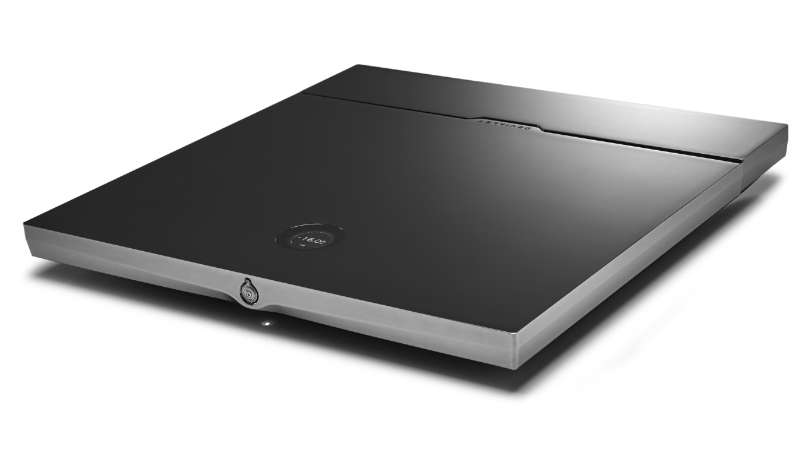

# Devialet Expert for Home Assistant

An unofficial, local Home Assistant integration for Devialet Expert amplifiers
using the pre-Core-Infinity Expert UDP protocol. Based on
[gnulabis/devimote](https://github.com/gnulabis/devimote).

Control power, volume, mute and input selection, with live amplifier readback
and a dedicated volume slider in **dB**. No cloud account or external Python
package is required.



> **Experimental integration, not an official Devialet product.**
> Volume controls span **-96.5 to +30 dB** with no reduced-volume safety ceiling.
> High volume can damage speakers or hearing. Start low and increase carefully.

## Features

| Feature | Behavior |
| --- | --- |
| Power | Switch the amplifier on or off; state follows its broadcasts |
| Volume | Full -96.5 to +30 dB range, in 0.5 dB steps |
| dB slider | Separate native number entity with actual dB values |
| Mute | Read and control mute state |
| Inputs | Select inputs advertised by the amplifier |
| Live status | Power, input, mute and volume from CRC-valid UDP broadcasts |
| Artwork | Bundled amplifier picture served locally by Home Assistant |
| Read-only mode | Enabled by default; blocks all amplifier commands |

This is an amplifier/receiver integration, not a playback source. It does not
provide play, pause, track selection or seeking.

## Compatibility and requirements

- Home Assistant **2026.9.0 or newer**.
- An amplifier exposing the legacy Expert UDP protocol used by devimote.
  Compatibility with other firmware, models or Core Infinity protocols is not
  established.
- The amplifier's IPv4 address, preferably reserved in DHCP.
- Network access for amplifier broadcasts to reach Home Assistant on
  **UDP 45454**, and commands to reach the amplifier on **UDP 45455**.
- **One amplifier per Home Assistant instance.** The listener owns UDP 45454.

The integration has been installed and verified in Home Assistant 2026.9.4.
Live status and power, volume, mute and source controls were confirmed by the
user on one Expert installation. High-volume operation has not been tested.

## Install through HACS

This is a **custom integration**, not a Home Assistant add-on. It is available
as a HACS custom repository, not in the default HACS catalog.

1. Open **HACS** and select **Custom repositories** from its menu.
2. Add `https://github.com/RZomerman/ha-devialet-expert`.
3. Select repository type **Integration**.
4. Find **Devialet Expert** and download it.
5. Restart Home Assistant.
6. Open **Settings -> Devices & services -> Add integration**.
7. Search for **Devialet Expert** and enter the amplifier's IPv4 address.

Setup starts in **read-only mode**. Verify that power, input and volume readings
match the amplifier before enabling commands.

### Enable controls

1. Open **Settings -> Devices & services -> Devialet Expert**.
2. Open the integration's **Options / Configure** dialog.
3. Disable **Read-only (no amplifier commands)** and save.
4. The integration reloads automatically; no full HA restart is needed.

Enabling controls does not send a command or change the current volume.
Test at a low listening level first. To disable commands again, re-enable
read-only mode.

### Updates

Download updates through HACS and restart Home Assistant to load the new Python
code. HACS can install from this repository's default branch; a separate ZIP
archive is not required.

### Manual installation

Copy the `custom_components/devialet_expert` directory from this repository into
`/config/custom_components/` on the Home Assistant host. Restart Home Assistant,
then add **Devialet Expert** through **Devices & services** as described above.
Do not copy just the Python files: the translations and bundled artwork are
part of the integration.

## Entities and volume controls

Both entities belong to the same Devialet device. Entity IDs depend on the
amplifier name and any names already registered in Home Assistant. These examples
use the observed device name `Devialet-WIFI`.

| Entity | Example ID | Purpose |
| --- | --- | --- |
| Media player | `media_player.devialet_wifi` | Power, mute, input and standard HA volume controls |
| Volume number | `number.devialet_wifi_volume` | Actual dB reading and dB slider |

### True dB slider

Open the device's **Volume** number entity to see its native slider:

- Minimum: **-96.5 dB**
- Maximum: **+30 dB**
- Step: **0.5 dB**
- Value: the amplifier's confirmed current volume, not an optimistic setting

The number entity is unavailable while read-only mode is enabled. The media
player still exposes readback in its attributes.

Home Assistant's built-in media-player slider always displays percentages.
The integration cannot change those labels. Its 0..100% position maps linearly
to -96.5..+30 dB; it is **not** a percentage of amplifier output power.
Use the separate number entity when you want dB values.

For a direct dB service call:

```yaml
action: number.set_value
target:
  entity_id: number.devialet_wifi_volume
data:
  value: -50
```

Replace the entity ID with yours. Running this action changes the volume;
the example does not run automatically.

### Media-player attributes

In addition to standard HA media-player attributes, the entity exposes:

| Attribute | Meaning |
| --- | --- |
| `volume_db` | Actual amplifier volume in dB |
| `active_input` | Current advertised input label |
| `muted` | Current mute state |
| `volume_min_db` | Minimum accepted volume command |
| `volume_max_db` | Maximum accepted volume command |
| `read_only` | Whether commands are disabled |
| `host` | Configured amplifier IPv4 address |

Physical readings outside the command range remain visible in `volume_db`;
the standard media-player slider saturates at its nearest endpoint.

The bundled product photo is the default entity artwork, including while powered
off. Cards that honor `entity_picture` can display it without an external image
host or separate dashboard setup. No Astrion or other remote bindings are
created automatically.

## Safety and state confirmation

- Read-only mode blocks commands even when called directly through HA services.
- Commands target only the configured host; packets from other hosts are ignored.
- Volume commands reject nonfinite and out-of-range values. Accepted values are
  quantized to 0.5 dB steps; a step beyond either endpoint raises an error.
- **There is no -28 dB safety ceiling** as of version 0.1.2. Power-on and source
  changes are not blocked based on the current volume.
- Physical controls, other clients and source gain are not limited by this
  integration.
- Commands are serialized and wait up to **5 seconds** for a subsequent status
  packet matching the requested value. Missing confirmation raises a visible
  HA service error; state is not updated optimistically.
- Confirmation means observed state, not a protocol acknowledgement. A timeout
  does not prove the amplifier ignored the command; check its actual state
  before retrying.
- The identified protocol exposes on/off, not boot progress. No "powering up"
  state is currently implemented. Power-on may take time.
- After **10 seconds** without a valid broadcast, the entity becomes unavailable.
  Stale state cannot be used to send commands.

## Networking and troubleshooting

### Integration retries setup or shows unavailable

Home Assistant must receive the amplifier's broadcasts. Check:

1. The amplifier is reachable, powered appropriately and connected to its network.
2. The configured IPv4 address is correct and has not changed.
3. UDP 45454 broadcasts reach the HA host. VLAN routing and firewall rules can
   prevent broadcasts even when ping works.
4. UDP 45455 can reach the amplifier for commands.
5. No other listener, probe or devimote process on the same host owns UDP 45454.

For Docker installations, host networking or suitable broadcast handling is
needed. **A successful ping does not verify UDP broadcast delivery.**
Review Home Assistant logs for `devialet_expert` errors.

### No volume or input controls

Check **Read-only** in the integration's options. In read-only mode the media
player advertises no control features. For volume in dB rather than percentages,
open the separate **Volume** number entity under the device.

### A command reports a timeout

The amplifier did not report the matching state within five seconds. Check its
physical state and live HA readback before repeating the action. Firmware or
network behavior may differ from the tested installation.

### Reporting issues

Open an [issue](https://github.com/RZomerman/ha-devialet-expert/issues) with your
amplifier model, firmware, HA version, integration version and relevant logs.
Describe expected and observed behavior. Remove credentials and any private
network information you do not want to publish.

## Development and validation

From the repository root with Python installed:

```shell
python -m unittest discover -s tests -v
python -m compileall -q custom_components
python probe.py --host AMPLIFIER_IPV4
```

The passive probe listens only and **never sends amplifier commands**. Stop it
before using another listener on the same host.

The 23 offline tests cover status parsing, CRC validation, host filtering,
read-only protection, command confirmation, repeated volume steps, the full
slider range and signed volume encoding. Tests use synthetic status frames and
fake transports. The optional upstream encoding-parity test requires an adjacent
`devialet-poc/devimote/src` checkout and skips when it is absent.

Known wire details:

- CRC16 CCITT-FALSE with seed `0xFFFF`.
- Observed 345-byte and documented 512-byte status frames are supported.
- Volume readback is `(raw - 195) / 2` dB, calibrated against physical readings.
- Commands use devimote's wire encoding, including its unusual volume encoding.
- Zero and positive-volume command bytes are checked offline against devimote.
  No high-volume commands were sent to validate these changes.

Offline encoding tests are not proof of hardware acceptance. HA runtime
validation and low-volume physical tests remain important for other installations.

## Attribution and license

Protocol implementation based on work by **Dimitris Lampridis / gnulabis** in
[devimote](https://github.com/gnulabis/devimote).
The integration code is distributed under **GPL-3.0-or-later**; see
[LICENSE.txt](LICENSE.txt).

The bundled [product image](custom_components/devialet_expert/brand/expert.png)
was supplied by the repository owner with permission to redistribute it. It is
not covered by the code's GPL license; image rights remain with its respective
owner. Devialet names and trademarks belong to their respective owners.
